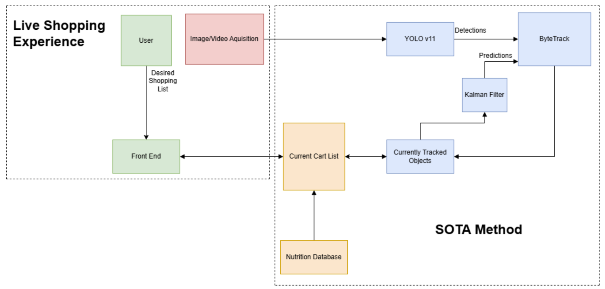

# GroceryIdentification
This project was completed for CS534: Introduction to Artifical Intelligence (Fall 2024)

## **Overview**
This system allows users to create, modify, and manage a grocery list dynamically through a front-end application. Using an AI assistant integrated with YOLOv11 for object detection and ByteTrack for object tracking, the application intelligently manages and tracks items in real-time based on the user’s shopping needs.

## Key Features

- **User-Friendly Front-End (TODO)**  
  Upon launching the application, users create an initial grocery list by selecting items from a predefined set. This list forms the foundation for the assistant to understand user requirements and adapt to real-time changes.   Users can modify the grocery list at any time during their shopping session. They can add new items, adjust quantities, and remove unnecessary entries. Additionally, users can override the assistant’s suggestions, maintaining full control over their shopping experience.

- **List Management System (TODO)**  
  The back-end uses a Python class to manage the grocery list as a dictionary, making the system scalable and modular. Key methods include:
  - **Add Items**: Ensures items from YOLO-trained classes can be added or incremented in quantity.
  - **Modify Quantities**: Allows users to adjust the quantity of any existing item.
  - **Remove Items**: Deletes unnecessary or incorrect entries from the list.
  - **List Status Check**: Displays the current list status, showing all items and their quantities.
  - **Alerts**: Notifies users of discrepancies, such as missing essential items or differences between AI recommendations and user inputs.

- **Data Sources for Nutritional Information (TODO)**

    The system can retrieve nutritional and allergen information from external sources to improve the shopping experience. Possible data sources include:

    - **Public Nutrition Databases**: Provides a wide range of standardized nutritional data for various items.
    - **Web Scraping from Local Chains**: Tailors nutritional data specifically from stores like Price Chopper.

    These data sources are modular and adaptable, allowing the system to select the optimal source based on factors like accuracy, reliability, and computational performance.

- **AI Integration**

    The AI assistant leverages YOLOv11 and ByteTrack to manage and track items effectively:

    - **YOLOv11**  
    Utilizes advanced computer vision techniques to detect items by dividing the image into a grid and predicting bounding boxes and class probabilities for objects within each cell. YOLO’s efficient, one-pass detection method is ideal for real-time applications.

    - **ByteTrack**  
    Assists in tracking objects by distinguishing new items from noise using a confidence-based sorting mechanism. ByteTrack uses Kalman Filtering to predict object locations, adding only new, high-confidence items to the tracking list, ensuring accurate and relevant item tracking.

## Installation

1. Clone this repository.
2. Install dependencies:
   ```bash
   pip install -r requirements.txt
3. run grocery_assistant_demo.py to see our final demo on a pre recorded video **TODO** 
4. run grocery_assistant_setup.py to setup a grocery assistant in your enviornment **TODO** 
5. run grocery_assistant.py to use your own grocery assistant! **TODO** 